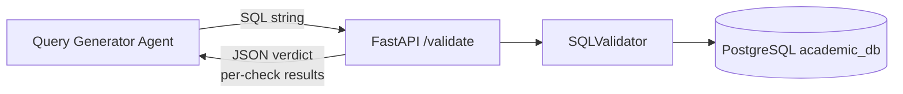
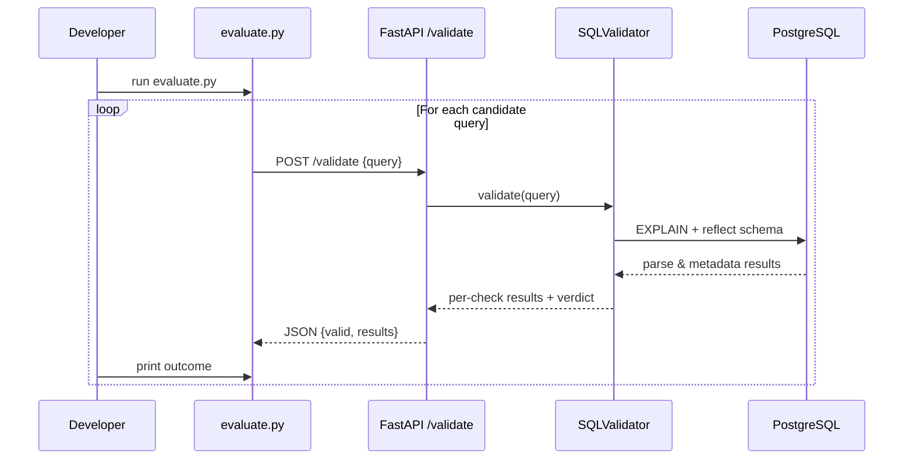

# SQL Validator Agent

A small FastAPI-based microservice plus a Python utility that validate SQL queries against a PostgreSQL academic schema.

It performs four checks:

- Syntax (via PostgreSQL `EXPLAIN`)
- Semantics (referenced tables exist in the reflected schema)
- Data range (year in 1–4, semester in 1–8)
- Security (simple SQL injection / dangerous keyword heuristics)

---

## Prerequisites

- **Python**: 3.9+ (recommended)
- **PostgreSQL** installed and running locally
  - A database named `academic_db` (or adjust the URI)
  - `psql` CLI client available on your PATH
- **Pip** for installing Python dependencies
- **Network access** to `http://localhost:8000` (for the FastAPI service)

### Database prerequisites

1. Create the database (if it does not exist):

   ```bash
   createdb -U <user> academic_db
   ```

2. Load the schema and sample data from `init_db.sql`:

   ```bash
   cd sql_validator_agent
   psql -U <user> -d academic_db -f init_db.sql
   ```

   This creates and populates:

   - `Student`
   - `Semester`
   - `Subjects`
   - `Marks`
   - `Timetable`

---

## Project structure

```text
sql_validator_agent/
├── app.py            # FastAPI microservice exposing /validate
├── validator.py      # SQLValidator class with all checks
├── evaluate.py       # Batch evaluation script for candidate queries
├── test_validator.py # Pytest test cases for the validator
├── init_db.sql       # DDL + rich sample data for PostgreSQL
├── requirements.txt  # Python dependencies
└── README.md         # This documentation
```

---

## Configuration

Update the PostgreSQL URI in both the FastAPI app and the tests to match your local setup.

In **`app.py`**:

```python
DB_URI = "postgresql://<user>:<password>@localhost:5432/academic_db"
```

In **`test_validator.py`**:

```python
validator = SQLValidator("postgresql://<user>:<password>@localhost:5432/academic_db")
```

Replace `<user>` and `<password>` with your actual PostgreSQL credentials.

---

## Installation & Setup (Instructions)

From the `sql_validator_agent` folder:

1. **Install dependencies**

   ```bash
   pip install -r requirements.txt
   ```

2. **Initialize the database (if not already done)**

   ```bash
   psql -U <user> -d academic_db -f init_db.sql
   ```

3. **Run the FastAPI microservice**

   ```bash
   python app.py
   ```

   - Service URL: `http://localhost:8000`
   - Endpoint: `POST /validate`
   - Request body (JSON):

     ```json
     {"query": "SELECT name, email FROM Student WHERE year = 1 AND semester = 1"}
     ```

4. **Manual API test (optional)**

   Using `curl` (Windows PowerShell example):

   ```bash
   curl -X POST "http://localhost:8000/validate" ^
     -H "Content-Type: application/json" ^
     -d "{\"query\": \"SELECT name, email FROM Student WHERE year = 1 AND semester = 1\"}"
   ```

   Expected JSON for a valid query:

   ```json
   {
     "valid": true,
     "message": "Query is valid",
     "results": [
       {"check": "Syntax", "valid": true, "message": "..."},
       {"check": "Semantics", "valid": true, "message": "..."},
       {"check": "Data Range", "valid": true, "message": "..."},
       {"check": "Security", "valid": true, "message": "..."}
     ]
   }
   ```

5. **Run the batch evaluator**

   Open a second terminal (keep the FastAPI server running), then:

   ```bash
   cd sql_validator_agent
   python evaluate.py
   ```

   The script will:

   - Loop through a list of candidate queries
   - POST each query to `/validate`
   - Print per-query results and a final summary like:

   ```json
   {
     "total": 10,
     "valid": 5,
     "invalid": 5
   }
   ```

6. **Run unit tests**

   ```bash
   cd sql_validator_agent
   pytest test_validator.py -v
   ```

   These tests cover:

   - Valid query
   - Invalid year (data range)
   - SQL injection / dangerous query
   - Nonexistent table (semantics)
   - Syntax error (incomplete WHERE clause)

---

## How the system works (Architecture)

### High-level architecture



- **Query Generator Agent**: your upstream component that produces SQL queries.
- **FastAPI /validate**: receives a query, invokes the validator, and returns structured results.
- **SQLValidator**: implements syntax, semantics, data-range, and security checks.
- **PostgreSQL**: provides the academic schema and actual SQL parser (via `EXPLAIN`).

### Evaluation flow (`evaluate.py`)


## How to plug this into your Query Generator Agent

This validator is designed to sit *inside* your Query Generator Agent (QGA) loop. The QGA proposes a SQL query, the validator evaluates it, and the QGA uses the feedback to refine the next attempt.

Below is a concrete Python example that shows how to:

- Call the `/validate` endpoint for each generated query.
- Interpret the per-check feedback.
- Retry a configurable number of times until a valid query is produced.

```python
import requests

API_URL = "http://localhost:8000/validate"


def generate_sql(nl_request: str, feedback: str | None = None) -> str:
    """Stub for your Query Generator Agent.

    Replace this with your real agent call (LLM, rules, etc.). The
    `feedback` string can be used to steer the next attempt when the
    previous one failed validation.
    """

    # Example: you would call your agent here instead of hardcoding
    # a response. This is just a placeholder.
    if feedback:
        # After receiving feedback, try a more constrained, safer query
        return "SELECT name, email FROM Student WHERE year = 1 AND semester = 1"

    # First attempt: intentionally bad (year out of allowed range)
    return "SELECT * FROM Student WHERE year = 5"


def validate_query(sql: str) -> dict:
    resp = requests.post(API_URL, json={"query": sql}, timeout=10)
    if resp.status_code == 200:
        data = resp.json()
        return {
            "ok": data.get("valid", False),
            "results": data.get("results", []),
        }
    else:
        detail = resp.json().get("detail", {})
        return {
            "ok": detail.get("valid", False),
            "results": detail.get("results", []),
        }


def generate_and_validate(nl_request: str, max_attempts: int = 3):
    """Loop: generate SQL, validate, and refine using feedback.

    Returns (accepted_sql, last_results). If all attempts fail, accepted_sql
    is None and last_results contains the checks from the final attempt.
    """

    feedback = None
    last_results: list[dict] = []

    for attempt in range(1, max_attempts + 1):
        sql = generate_sql(nl_request, feedback)
        verdict = validate_query(sql)
        last_results = verdict["results"]

        if verdict["ok"]:
            print(f"Attempt {attempt}: accepted SQL")
            return sql, last_results

        # Build a simple feedback string from failing checks
        failing = [
            f"{c.get('check')}: {c.get('message')}"
            for c in last_results
            if not c.get("valid")
        ]
        feedback = "; ".join(failing)
        print(f"Attempt {attempt}: rejected, feedback to QGA -> {feedback}")

    print("All attempts failed validation")
    return None, last_results


if __name__ == "__main__":
    natural_language_request = "List names and emails of first-year students in semester 1."
    sql, results = generate_and_validate(natural_language_request, max_attempts=3)
    print("Final SQL:", sql)
    print("Checks:", results)
```

To integrate with your real QGA:

- Replace `generate_sql` with a call into your agent (LLM, rules, etc.).
- Encode the `feedback` string (or the raw `results`) into the agent prompt / state.
- Use `generate_and_validate` inside whatever orchestration framework you use (custom loop, LangChain, etc.).

---

## What's next?

A few ideas to extend or integrate this component further:

1. **Deeper semantic checks**

   - Validate column names and join keys instead of only table existence.
   - Check that selected columns belong to the referenced tables or aliases.
   - Enforce constraints like `WHERE` clauses aligning with foreign-key relationships.

2. **Tighter integration with your Query Generator Agent**

   - Wrap the `/validate` call inside the agent so each generated query is immediately validated.
   - Use the per-check messages (`Syntax`, `Semantics`, etc.) as feedback signals for iterative refinement.

3. **Evaluation pipeline enhancements**

   - Extend `evaluate.py` to read queries from a JSON / CSV file.
   - Export results to a machine-readable report (JSONL) for offline analysis.
   - Track pass/fail rates per check type (syntax vs semantics vs security).

4. **Operational hardening**

   - Add logging and metrics (e.g., FastAPI middleware + Prometheus).
   - Add rate limiting or authentication on the `/validate` endpoint.
   - Containerize with Docker and use `docker-compose` to run both FastAPI and PostgreSQL.

5. **UI or tooling on top**

   - Build a small web UI that lets users paste a query and view validation results per check.
   - Integrate with your IDE or internal tools as a "SQL linter" against this academic schema.

---

## Quick integration snippet (from another Python service)

If another Python service wants to validate queries directly:

```python
import requests

resp = requests.post(
    "http://localhost:8000/validate",
    json={"query": "SELECT * FROM Student WHERE year = 1"},
    timeout=10,
)

if resp.status_code == 200:
    data = resp.json()
    if data.get("valid"):
        print("Query accepted", data["results"])
    else:
        print("Unexpected invalid query", data["results"])
else:
    detail = resp.json().get("detail", {})
    print("Query rejected", detail)
```

This is the same contract used by `evaluate.py` and is suitable for hooking into your Query Generator Agent or other microservices.
